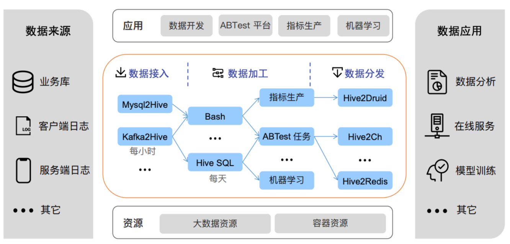

# d10-scheduler
系统主要基于大数据离线调度的场景进行设计，同时借鉴[elastic-job](https://shardingsphere.apache.org/elasticjob/) 的弹性调度与[Quartz](http://www.quartz-scheduler.org/) 的调度策略进而构建了基于DAG的分布式任务调度系统。
对标[Apache DolphinScheduler](https://dolphinscheduler.apache.org/zh-cn/index.html) </br>

简单易用是本项目的目标、初步立一个小flag 2022年100个star！！

#### 整体架构


#### 核心逻辑设计
很多开发者对于DAG非常的熟悉，非常不理解为什么在任务调度领域会区分定时调度以及基于DAG的调度。不就是一个小功能特性吗？至于这么麻烦？

其实在一般的业务系统中构建依赖关系的确不难，但是在任务调度的领域还有一个不可忽视的变量---时间。它是一个需要预测未来的设计、尤其是其中的难点【跨周期的任务依赖】(跨周期例子：A->B，A的运行周期是每天执行一次,B的运行周期是每周一执行一次)

简单的说就是两个任务不在同一个时间维度，想让它们相互构建成一张DAG是非常困难的。

##### 概念解释
```markdown
 任务：用户在产品页面进行配置的结果、需要设定运行周期、周期用crontab表示
 版本：任务的一个运行周期内只会有一个版本
 实例：版本的某一时刻只会有一个实例在运行（保留运行记录与刷数历史）
 表 ： hive表、数仓的基础建设
 分区：hive表的划分方式，一般实践中会根据时间进行分区
 时间参数：动态的时间生成，搭配着hive表的时间分区和任务每天运行使用，
 
 具体的作用和来源可以参考后续给出的详细设计文章
```
这些概念交织在一起，形成成下面的结构


想知道更加详细的设计可以参考[任务调度系统DAG设计](./doc/任务调度系统DAG设计.md)
#### 特性如下：
- 弹性调度：调度器高可用，任务会归属于多个调度器中的一个。当发生故障，会自动的转移到其他可用的调度器中 详细设计参考 [弹性调度设计](./doc/弹性调度设计.md)
- 灵活的DAG依赖体系：跨周期的任务依赖配置很方便
- 数据回填：当计算逻辑发生变化，可进行重新刷数来保证新老数据逻辑的一致性
- 任务失败重试、报警
- 任务执行过程可观测

#### 未来规划
- 多租户资源设计：与底层yarn队列打通、实现客户端的资源调度
- web page


#### 如何使用：
```markdown
todo
```
