## 任务调度系统DAG设计
数据因为连接而产生更大的价值！这是大数据时代的底层色彩、所以稍有规模的公司都会组建自己的数据团队来专门的为数据服务。任务调度系统解决的就是数据的连接管理问题！(以下简称 调度)它就像是一条高速公路与加油站、而数据则是路上的车辆，时不时的需要加油才能驶离这条公路。
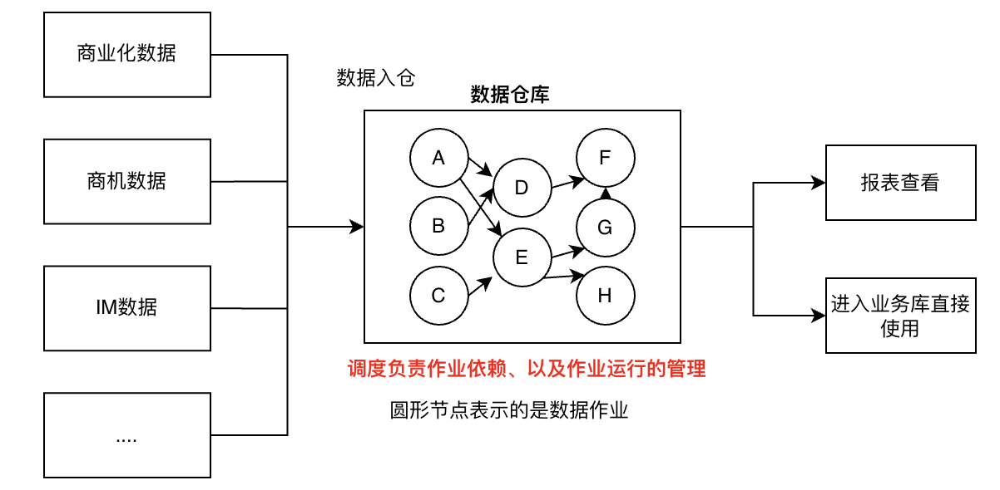
这套流程的核心就是作业调度管理和数据的ETL(Extract,Transform,Load)、调度就是解决哪些作业先运行以及如何运行的问题。在业界有一些知名的开源系统，比如Azkaban，Airflow以及最近的 DolphinScheduler (也叫EasyScheduler)</br>
它们底层对于DAG的设计基于各自的系统特性都各不相同、对于其中关键的难点【跨周期的任务依赖】的处理方式也不同。但基本都是需要对跨周期依赖的节点进行特殊处理，例如airflow的ExternalTaskSensor以及DolphinScheduler的Dependent节点。</br>
而目前业界还存在着一种灵活的跨周期依赖体系、二者的优劣暂时不比较，先看看它是怎么做到的吧。

#### 实践生产中的问题
在这个存储和计算如此廉价的时代、企业是能够承担在数据仓库中存储所有历史数据的成本的、这就意味着在需要的时候可以对历史数据进行重新的处理来响应新的变化(简单来说就是 计算逻辑变化、需要重刷数据==>这个过程叫做 数据回填 Backfilling)。</br>
但是存储的数据量过多带来的是查询分析性能的下降、遵循Hive SQL的以下最佳实践 "filter early and often"，"project only the fields that are needed" 改善性能最有效的措施就是将数据分区。按照什么分区呢？</br>
一般按照时间进行分区(通常是 天)、因为这暗合了数据的变更周期也同时能够满足业务方看数据的需求。</br>
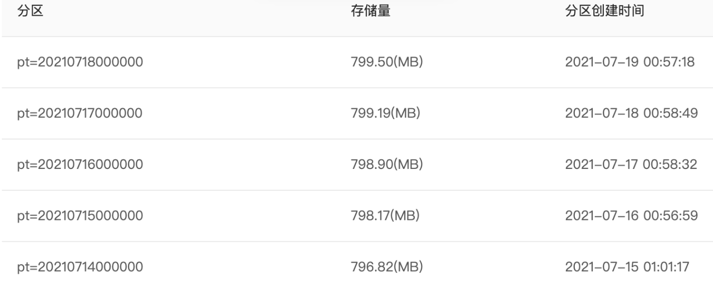
写数据时也很简单、能将数据写入该表的确切分区中。可以看出表和写入的目标任务是存在关联关系的、一般一个任务中只允许往一个表中写数据。所以这个任务会和dwd.tb4表有唯一的映射、一般表名与任务名实际是趋同的。(数仓的建模规范中每一层有专门的称呼 类似于,stg->ods->dw->olap、这里不深入讨论)</br>
```sql
insert overwrite table dwd.tb4 partition(pt=2021071700000)
select xxx from stg.tb1 
join stg.tb2
join stg.tb3
....
where stg.tb1.pt='2021071700000'
stg.tb2.pt='2021071500000'
stg.tb3.pt='2021071600000'
....
```
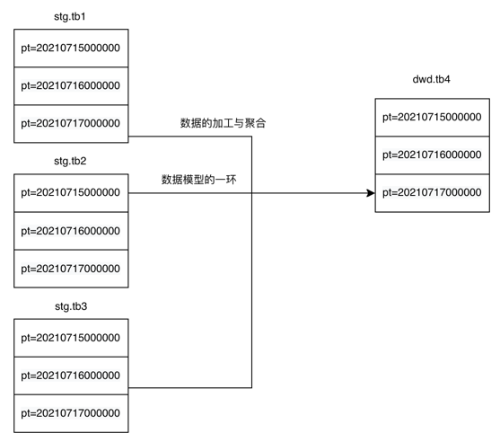</br>
但数据需要根据时间、写入不同的分区。总不能每天改一次任务的配置吧、一般的会想到用hive自带的时间函数、例如current_date等进行操作、这样就能够获取动态的时间了。
```sql
insert overwrite table dwd.tb4 partition(pt=date_sub(current_date,1))
select xxx from stg.tb1 
join stg.tb2
join stg.tb3
....
where stg.tb1.pt= date_sub(current_date,1)
stg.tb2.pt= date_sub(current_date,3)
stg.tb3.pt= date_sub(current_date,2)
....
```
它延伸出来的问题就是、假如指标的计算逻辑发生了变化，用户更改了逻辑后需要把原本的历史数据一起刷新(也就是数据回填)、在运行任务的那一天时 -1d的时间表示与原本自然运行的时间表示就会错位。例如历史的运行时间是 2020.07.17、-1d表示的是2020.07.16，现在于2021.07.17重刷之前的数据、那么-1d表示的就是2021.07.16。</br>
这样刷出来的数据自然都是错误的了、因为它的来源与去向依赖了具体的运行时间、而运行时间本身就是不固定的。这里的时间不止是时间、还表示具体某一个部分的数据！</br>
所以我们需要引入时间参数以及参考时间的概念、关于时间参数这里给出几个例子：</br>
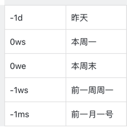
```sql
insert overwrite table dwd.tb4 partition(pt='${-1d_pt}')
select xxx from stg.tb1 
join stg.tb2
join stg.tb3
....
where stg.tb1.pt='${-1d_pt}'
stg.tb2.pt='${-3d_pt}'
stg.tb3.pt='${-2d_pt}'
....
```
看到这里相信大家也明白了参考时间的设置，是系统刷数非常重要的一环！ 而参考时间如何定义生成？这个问题下个小节回答。
#### 调度的应对策略
##### 核心设计
在系统中运行的所有作业都有周期，我们定义为任务。下列是关于系统核心概念的名次解释
- 任务：用户在产品页面进行配置的产物、(需要设定运行周期、用crontab表示)
- 版本：任务的一个运行周期内只会有一个版本（版本号 就是上文中的参考时间）
- 实例：版本的某一时刻只会有一个实例在运行（防止计算逻辑冲突与保留刷数历史） 

参考时间其实就是版本的版本号、通过任务的运行周期进行计算得出。一旦计算完毕就不会进行更改、运行时会将该参考时间与用户的sql一起传入程序、最终会生成一个用户平常写的sql(不带时间参数)进入底层运行。 </br>
通过任务的crontab计算得出它在某周期内哪一天运行、那么版本号就是对应日期的字符串形式。例如 crontab=0 0 * * * 表示的是每天0点运行、那么该任务的版本号就会有 20210717000000、20210716000000，20210715000000.....。</br>
细心的同学会发现版本号与目标表之间存在着gap、版本号作为参考时间而insert进表分区的则是用户输入的时间参数、例如上述例子中的 -1d_pt。这就表示任务的版本与表的数据分区实际上并不是完全对应的、它是一种错位关系。但是可以通过计算得出、这点非常的关键！</br>
例如一般的天级别任务(每天运行一次)、都是写入对应表昨天的分区、那么它们版本与表数据分区之间的gap=1。</br>
##### 依赖关系的建立
任务之间的依赖其实就是sql中 insert overwrite 的目标表 依赖了select from的几张数据源表。以上文中提到的sql为例：依赖关系如下</br>
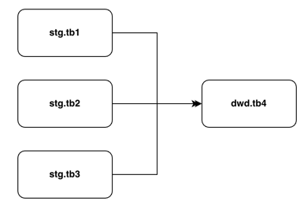</br>
这样的依赖关系很容易就可以提取出来、因为来源与去向都很明确。但还记得吗、我们具体运行的时候是精确到了表的分区的。所以实际运行时的依赖关系应该是这样的</br>
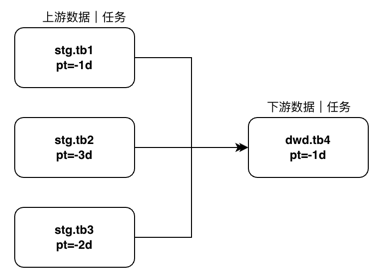
运行时依赖关系中是包含了更细粒度的分区的、在调度中体现为运行时依赖关系关联到了版本上、而不是用户直接接触的任务。</br>
所以问题就是：任务与版本之间的依赖关系存在着一个鸿沟、版本依赖是更细粒度同时也是运行时真正需要考虑的。而版本是动态生成的、对用户来说是无感知的！那我们实际运行时的依赖关系如何确定呢？</br>
理论上用户只要把sql写完、就ok了；依赖关系则由平台解析sql完成自动的配置、简化用户的接入成本。调度就任务-版本-数据分区-时间参数之间的gap、给出了答案</br>
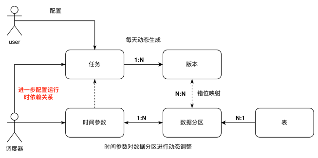</br>
我们给出的答案是结合sql中的pt、表数据分区与实际运行版本的关联特性、推出offset与cnt这两个工具、它们是用于描述下游与上游的依赖参数。因为调度还是以任务-版本-实例为管理主体、所以系统中的设计也都是这样。</br>
- offset = 距离上游最新的版本相隔 offset 个版本为原点
- cnt = 从offset确定的原点开始、往右数cnt个版本都是需要依赖的

对于最新版本的理解是：今天内该任务的第一个版本（因为存在小时级任务、一天会有24个版本）、对于小时级任务来说、就是0点的版本为原点。对于其他周期的任务来说、就是今天唯一生成的版本为原点（如果今天没有生成版本、就往昨天去看、以此类推）</br>
像人类理解的依赖关系中，口语的表达就是 A任务依赖B任务的前两个版本。offset和cnt是偏向数学概念，帮助程序来自动计算，也是我们人类去更清晰准确的理解任务间动态依赖关系的途径、像上面的A任务依赖B任务的前两个版本，数学表达形式A->B(-2,2)，如果是前三个版本中的前两个  A->B(-3,2) </br>
应用这个工具、上述例子对于dwd.tb4(任务周期为天)就可以表述为: 隐性条件 -1d 表示为昨天0点的分区、如果任务是小时级的则-1d表示它前24个小时的分区。</br>
逻辑链条是：下游用到了上游具体的哪个数据分区，而具体这个数据分区是由任务的哪个版本写进去的 

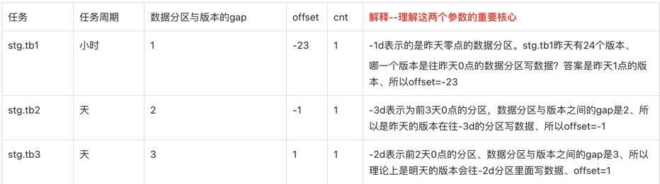</br>
可以看到对于stg.tb3这个任务的配置会比较奇怪、但是按照上述给出的背景(包括任务周期、dwd依赖的pt，数据分区与版本的gap)来看，想要使用这个表-2d_pt的数据、只能等到它明天的版本运行完成才可以。例如今天是2021.07.22、那么就需要等到2021.07.23这个版本完成才会写入它-2d_pt的数据。</br>
对于周级别的乃至月级别任务、只要使用的时间参数是对应的周期，那么就和天级别的依赖设置相同。但当这种大周期的任务和小周期任务混搭的时候、总是有用户摸不着头脑。</br>
offset锚定之后、cnt的计算很简单、就不细说了。目前线上运行的实际情况比较复杂、很多时候需要人工的调整参数才行。例如有的任务一周只在周一和周五运行(这种周期就很难在系统上归类)、有些任务需要依赖上个月同一天的数据、只能人理解了这些逻辑之后才能够写出正确的配置。</br>
这套体系只能解决99%的配置问题、还有少数的需求需要专业的同学指导。</br>

##### dag图运行节奏
运行时依赖关系建立完毕、之后自然是与具体的运行顺序进行绑定。我们的预期就是任务按照最开始的源头进行触发、然后一层层一个个的按照依赖关系的顺序运行。这个涉及到版本的生命周期建设与管理：</br>
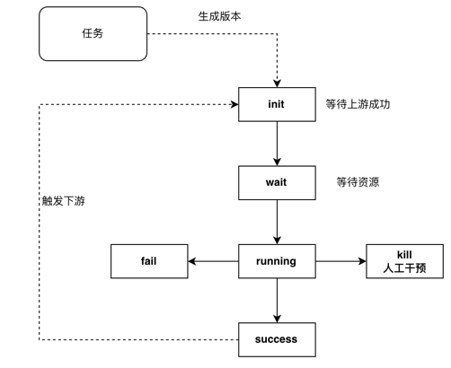</br>
运行成功的版本添加一个trigger、会尝试触发它的下游版本进入运行状态。而这时下游节点本身会开展check行为、去判断它的所有上游是否已经完成。期间注意多个上游同时完成、同时触发的锁问题之外 没啥值得注意的点。</br>
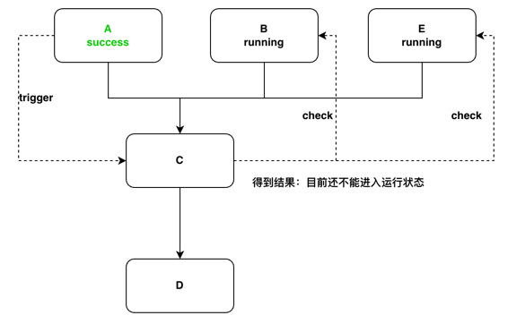

##### 设计的优缺点
对比DolphinScheduler和Airflow的跨周期依赖的设计、这种方案的配置将跨周期的依赖节点当作普通的依赖，并没有进行特化。把跨周期的依赖 当作单独的任务去对待，不断的check上游是否完成</br>
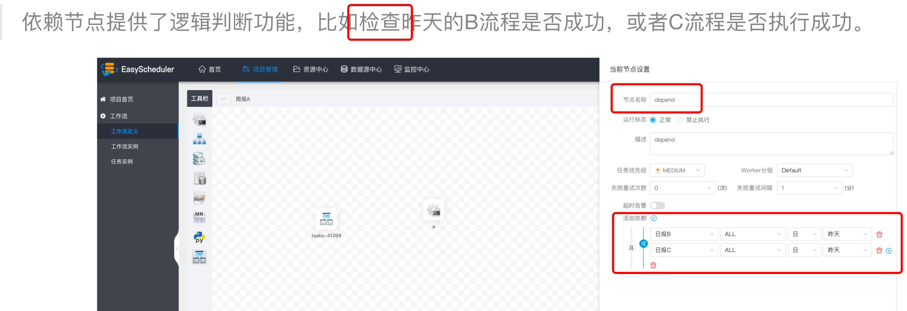</br>
总结、这种方案的优缺点如下：
- 优点：这种设计能够很通用的适应各种语言和架构，任务的依赖配置非常的灵活，面对各种夸周期的依赖。诸如 天任务依赖周任务，周任务依赖月任务等等复杂的场景都能解决。
- 缺点：理解成本比较高，用户配置起来比较吃力。

#### 参考文章：
https://medium.com/@rchang/a-beginners-guide-to-data-engineering-the-series-finale-2cc92ff14b0 </br>
https://medium.com/@rchang/a-beginners-guide-to-data-engineering-part-ii-47c4e7cbda71 </br>
https://medium.com/@rchang/a-beginners-guide-to-data-engineering-part-i-4227c5c457d7 </br>
