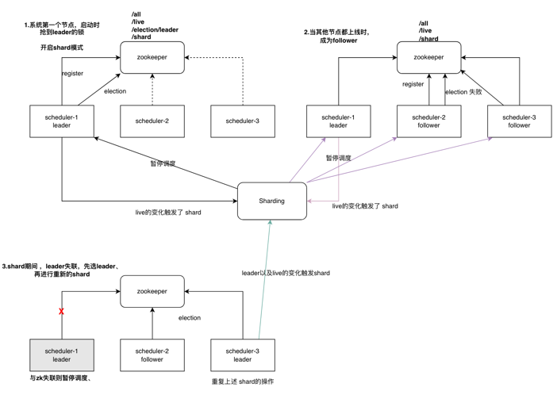
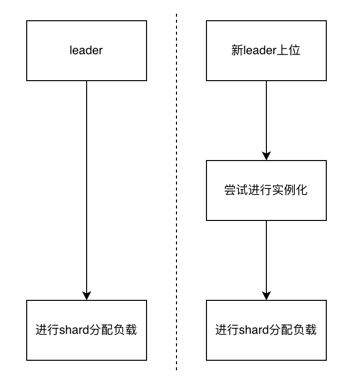
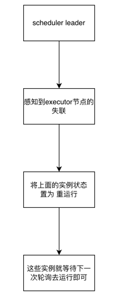
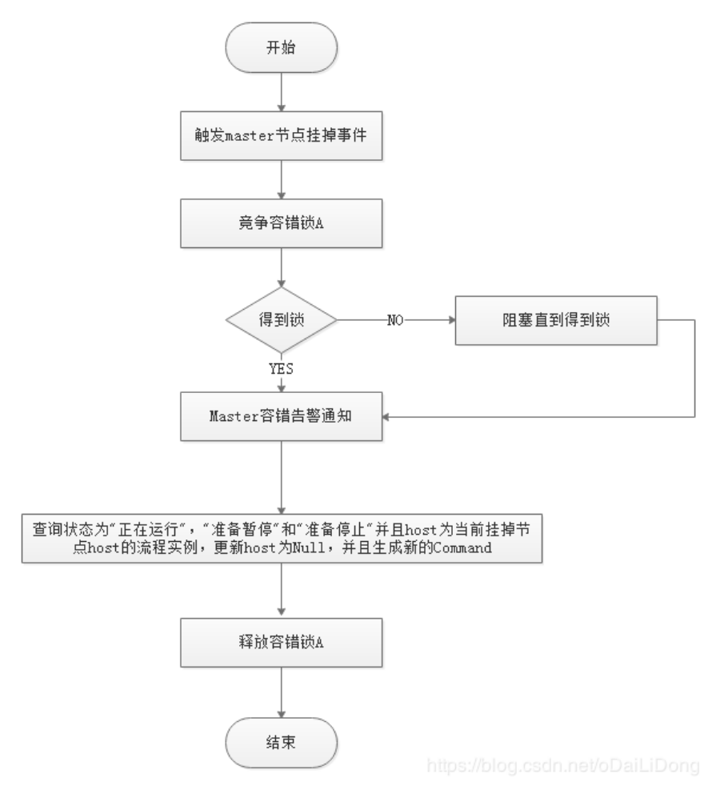

### 弹性调度设计
因为需要感知集群节点的变化，同时也需要有一个协调同步的机制。引入了zookeeper来实现的弹性调度模块，方案参考了Elastic-Job与Dolphin-Scheduler。以下是设计细节

#### zookeeper数据结构设计
- /live/{nodes}：记录所有存活的节点，里面的信息是address和分片的范围、{nodes}是临时节点；当它发生变化的时候，就会触发 shard 操作。而 /live本身是持久的节点、上面的数据记录着每个节点的负责taskIds范围
- /all/{nodes}：记录所有接入的节点、用作后续拓展备份，永久节点
- /election：永久节点，用于创建leader的前置
- /election/leader：临时节点，leader可以把自己的 address信息写入节点。
- /shard：临时节点，当节点存在时、所有的调度节点会暂停调度工作。shard节点是当 /live 路径下节点数量发生变化，由leader创建，并于shard工作结束后删除。

流程图如下：

#### Shard的流程
- 1./live 路径下节点数量发生了变化、leader会创建/shard、而所有的节点都注册了对/shard的watcher、通过这种机制来通知其他的节点、暂停调度
- 2.leader会根据分片策略将最新的分片数据写入/live 节点中，所有节点都是通过感知/live 的node_changed来获取最新的shard计划
- 3.leader将/shard节点删除（为了下一个shard过程能正常启动）
##### 分片策略
目前提供的默认分片策略是：ScopeStrategy、后续可进行拓展选择。这个策略简单来说就是将所有的任务划分成一个个范围，将每个调度节点对应到这些范围，只负责自己范围内的任务。当节点变化，则范围也会跟着扩张或者收缩
- 1.将任务总数除以总节点数，得到平均每个节点的负载
- 2.将节点按照地址排序，排序的好处是可以让节点负责的范围更加稳定
- 3.由于任务数与节点数可能不是整除关系，所以最后一个节点的负责范围就会扩张到任务总数，而不是单纯的按照平均的负载进行。
  
假设总数2300个任务，3个节点的平均负载是 760，那么节点负责的范围依次是1～760，761～1521，1522～2300
#### 故障恢复
##### Scheduler
调度器的故障恢复其实很简单，就是进行shard过程，将故障节点负责的任务范围分给其他节点。所以在shard期间需要进行调度的暂停，防止重复的调度。如果是leader发生故障，则需要重新进行选举、然后进行shard和实例化。

scheduler的故障恢复不需要把故障时在它上面运行的任务进行一个状态恢复吗？ 
这就要得益于我们任务调度体系的设计了。详细参考：[任务调度体系设计](./任务调度体系.md) 
##### Executor
执行器的故障恢复则需要将之前在上面运行的任务，重新分发到其他的节点上。这点会相对来说简单明了一些。 失联的节点本身，在实践中证明 可能会有一些任务还在运行，这个需要清理。以及需要确保任务的幂等性。

重新分发很容易，但是要想把机器上相关的任务kill了 可就需要额外的联动了。很可能在发布或者节点意外死亡的情况下 产生一些孤儿进程。而这些进程、则是代表了一个个的任务。
###### 任务子进程的kill
- JVM增加shutdown hook；将节点上的任务进程先kill了
- 在发布的时候，增加额外的清理脚本。将节点上的任务进程先kill了；
  
这两个策略基本能覆盖节点挂了的绝大多数场景，有些覆盖不了的例如操作系统强杀、或者程序出了RuntimeException等暂时没办法解决，但幸运的是绝大多数情况下有这些问题也可以通过管理员手动的kill加上重跑任务解决这些问题

#### 其他项目的方案是怎么样的
##### Elastic-Job 作业与注册中心无法通信会如何?
为了保证作业的在分布式场景下的一致性，一旦作业与注册中心无法通信，运行中的作业会立刻停止执行，但作业的进程不会退出。 

这样做的目的是为了防止作业重分片时，将与注册中心失去联系的节点执行的分片分配给另外节点，导致同一分片在两个节点中同时执行。 当作业节点恢复与注册中心联系时，将重新参与分片并恢复执行新的分配到的分片。
##### Dolphin-Scheduler 宕机容错
由于” 网络抖动”可能会使得节点短时间内失去和ZooKeeper的心跳，从而发生节点的remove事件。对于这种情况，DS使用最简单的方式，那就是节点一旦和ZooKeeper发生超时连接，则直接将Master或Worker服务停掉。

故障节点上面的任务由其他的节点进行恢复、如果是Master类型的节点则重新遍历 DAG 找到”正在运行”和“提交成功”的任务，对”正在运行”的任务监控其任务实例的状态，对”提交成功”的任务需要判断Task Queue中是否已经存在，如果存在则同样监控任务实例的状态，如果不存在则重新提交任务实例。

参考文档：

https://shardingsphere.apache.org/elasticjob/current/cn/features/elastic/

https://dolphinscheduler.apache.org/zh-cn/docs/2.0.0/user_doc/architecture/design.html